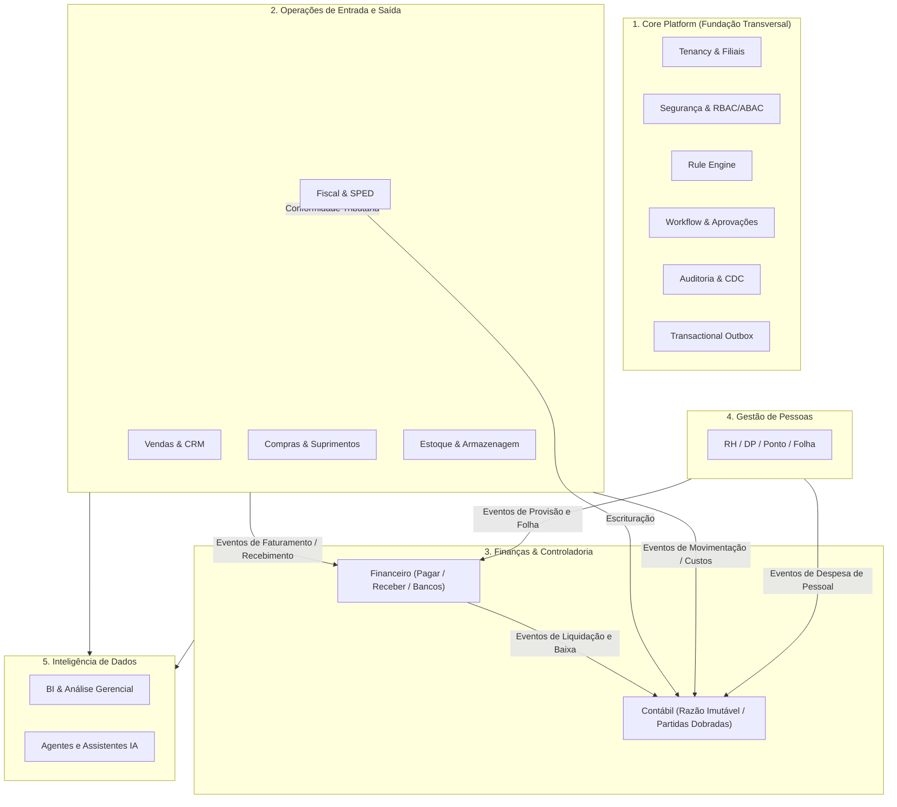
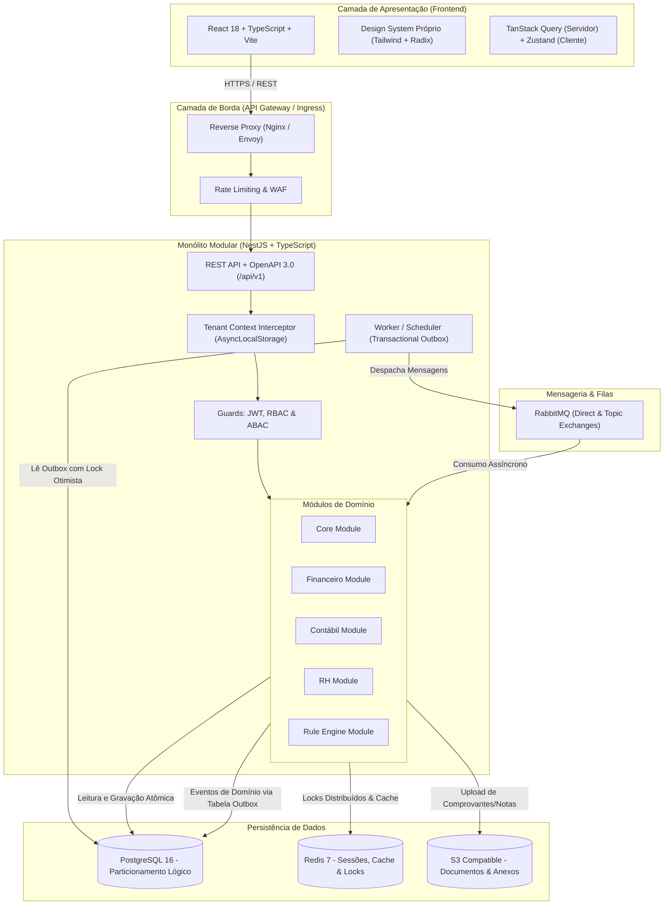
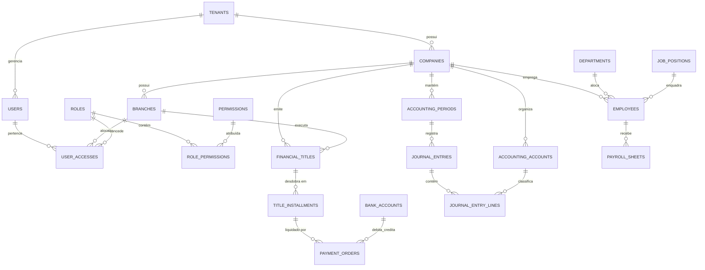
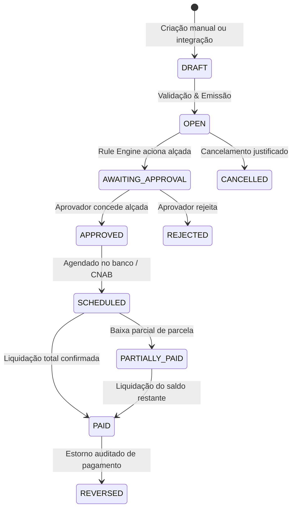
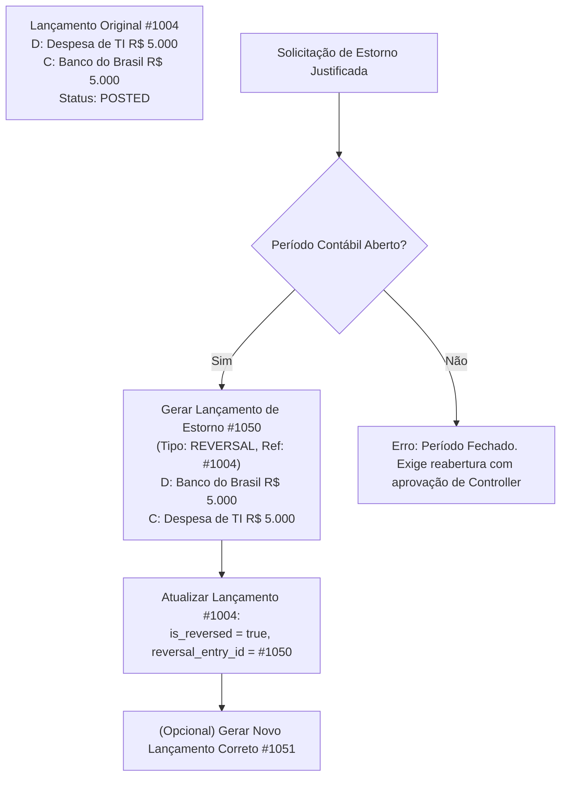
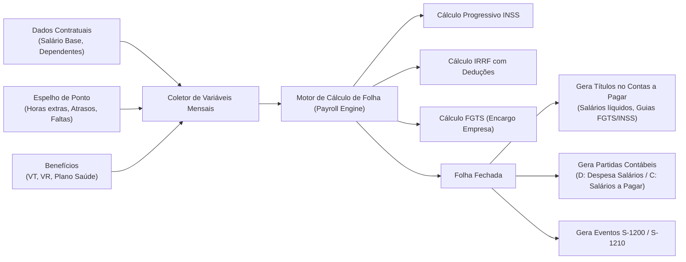
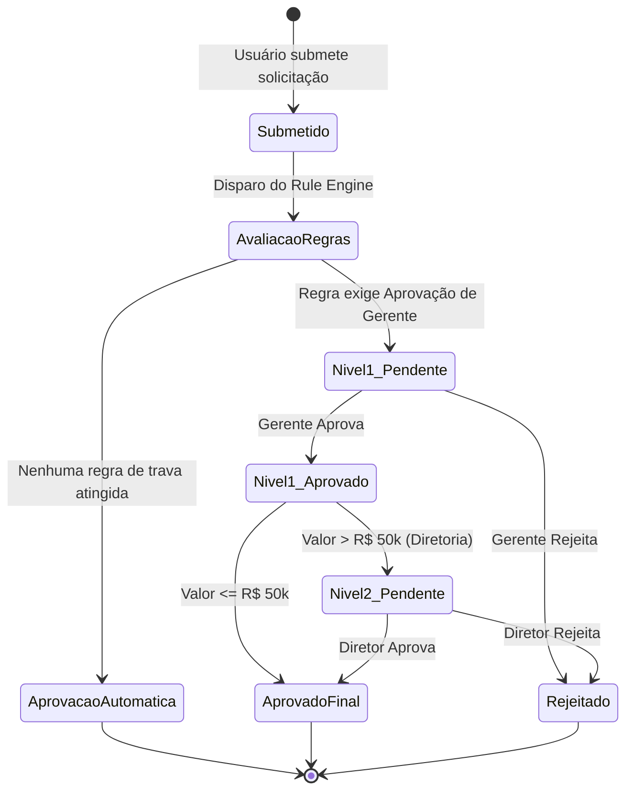

# Blueprint Técnico e Arquitetural Definitivo: ERP v1

> **Premissa Inegociável:** ERP 100% novo, construído do zero, corporativo, independente de qualquer sistema ou regra legada.  
> **Arquitetura Base:** Monólito Modular Orientado a Eventos com *Domain-Driven Design (DDD)* e *Clean Architecture*.  
> **Garantia Central:** Razão contábil estritamente imutável (partidas dobradas), governança multi-tenant lógica rigorosa e motor de regras desacoplado.

---

## 1. Visão Completa do Produto

### 1.1 Proposta de Valor
O ERP é projetado para empresas de médio e grande porte com múltiplos CNPJs, filiais e unidades de negócio. O produto entrega:
- **Consistência Contábil e Financeira:** Todo evento financeiro ou operacional reflete automaticamente em lançamentos contábeis auditáveis e imutáveis.
- **Autonomia Operacional por Módulos:** Os módulos funcionam com baixo acoplamento e independência de ciclo de vida dentro do monólito modular.
- **Governança e Compliance:** Trilha de auditoria ponta a ponta (CDC), segregação de funções (SoD - *Segregation of Duties*), alçadas dinâmicas e assinatura digital/imutabilidade.
- **Extensibilidade Orientada a Regras:** Customizações de negócio são feitas via motor de regras declarativo (*Rule Engine*), sem bifurcação de código.

### 1.2 Bounded Contexts e Visão Sistêmica


### 1.3 Personas Principais
1. **CFO / Diretor Financeiro:** Exige visibilidade em tempo real de DRE, fluxo de caixa consolidado, controle rígido de alçadas de pagamento e travas orçamentárias.
2. **Controller / Contador Geral:** Exige imutabilidade contábil, conciliação 1:1, facilidade de auditoria externa e conformidade legal estrita (ECD/ECF/SPED).
3. **Gerente de Compras / Supply Chain:** Necessita de cotações ágeis, pedidos integrados a contas a pagar e controle de recebimento físico e fiscal no estoque.
4. **Gerente de RH / Departamento Pessoal:** Requer fechamento de folha sem erros, integração contábil e bancária (pagamentos de salários) e conformidade eSocial.
5. **Auditor / Compliance Officer:** Analisa trilhas de auditoria, histórico de aprovações, tentativas de acessos indevidos e justificativas de estornos.

---

## 2. Arquitetura Técnica

### 2.1 Visão Física e Lógica


### 2.2 Estratégia de Transações e Transactional Outbox
1. **Regra de Ouro:** Nenhuma entidade externa ou barramento assíncrono é acionado no meio de uma transação de banco de dados.
2. **Mecanismo:** Ao salvar qualquer mutação no domínio (ex: liquidação de um título), a entidade grava na mesma transação atômica do PostgreSQL o registro na tabela `outbox_events`.
3. **Despacho Garantido (At-least-once Delivery):** O worker processa os eventos pendentes com chave idempotente e publica no RabbitMQ.
4. **Idempotência no Consumo:** Todos os manipuladores de eventos (*consumers*) checam histórico de execução por `event_id` antes de processar.

---

## 3. Mapa de Módulos e Submódulos

```text
ERP ENTERPRISE v1
│
├── 1. CORE & PLATAFORMA BASE
│   ├── Tenancy (Multi-tenant)
│   ├── Organização (Empresas, Filiais, Unidades de Negócio)
│   ├── Usuários e Identidades
│   ├── RBAC (Perfis, Permissões granulares)
│   ├── ABAC (Políticas por atributo, filial e alçada)
│   ├── Auditoria & CDC (Histórico imutável de alterações)
│   ├── Motor de Regras (Rule Engine declarativo)
│   ├── Workflow de Aprovações (Esteiras multi-nível)
│   ├── Notificações (E-mail, In-App, Push)
│   ├── Gestão de Arquivos & Storage S3
│   ├── Custom Fields & Metadados
│   └── Logs de Execução & Métricas
│
├── 2. FINANCEIRO
│   ├── Contas a Pagar (Títulos, parcelas, liquidações)
│   ├── Contas a Receber (Cobranças, faturas, inadimplência)
│   ├── Tesouraria & Caixa (Saldos diários, transferências)
│   ├── Gestão Bancária (Contas correntes, agências)
│   ├── Meios de Pagamento (PIX via Open Finance / API, Boletos)
│   ├── CNAB (Remessas e Retornos 240 e 400)
│   ├── Conciliação Bancária (Importação OFX e conciliação 1:1)
│   ├── Fluxo de Caixa (Realizado, Previsto e DFC Gerencial)
│   ├── Centros de Custo & Rateios
│   ├── Gestão de Crédito e Limites
│   └── Antecipação e Repactuação de Dívidas
│
├── 3. CONTÁBIL
│   ├── Plano de Contas Estruturado (Ativo, Passivo, PL, Receitas, Despesas)
│   ├── Plano de Contas Referencial (Mapeamento SPED / RFB)
│   ├── Livro Razão Imutável (General Ledger)
│   ├── Livro Diário Geral
│   ├── Motor de Partidas Dobradas (Débito = Crédito rigoroso)
│   ├── Mecanismo de Estornos Auditados
│   ├── Balancete de Verificação (Analítico e Sintético)
│   ├── DRE (Demonstração do Resultado do Exercício)
│   ├── Balanço Patrimonial
│   ├── DFC Contábil (Método Direto e Indireto)
│   ├── Períodos Contábeis & Travas de Fechamento Mensal/Anual
│   └── Dimensões Analíticas de Custos
│
├── 4. RECURSOS HUMANOS & DEPARTAMENTO PESSOAL
│   ├── Cadastro de Colaboradores e Dependentes
│   ├── Organograma (Departamentos, Centros de Resultado)
│   ├── Cargos, Salários e Níveis de Carreira
│   ├── Gestão de Admissão, Contratos e Afastamentos
│   ├── Ponto Eletrônico (Jornadas, Escalas, Batidas, Banco de Horas)
│   ├── Gestão de Férias (Período Aquisitivo e Concessivo)
│   ├── Gestão de Benefícios (VT, VR, Planos de Saúde)
│   ├── Motor de Folha de Pagamento (Proventos, Descontos, Encargos)
│   ├── 13º Salário e Adiantamentos
│   ├── Rescisão e Cálculos Rescisórios
│   ├── eSocial (Geração e mensageria de eventos legais)
│   └── Portal do Colaborador (Holerites, Espelho de Ponto)
│
├── 5. FISCAL (Planejado)
│   ├── Escrituração Fiscal (Entrada / Saída)
│   ├── Regras de Tributação (ICMS, IPI, PIS, COFINS, ISS)
│   ├── Emissão de Documentos Fiscais (NF-e, NFS-e, NFC-e)
│   └── SPED Fiscal e SPED Contribuições
│
├── 6. COMPRAS & SUPRIMENTOS (Planejado)
│   ├── Requisições de Compra
│   ├── Cotações e Coleta de Preços
│   ├── Pedidos de Compra e Alçadas
│   ├── Gestão de Fornecedores e Homologação
│   └── Entrada de Mercadorias e Espelho de NF
│
├── 7. ESTOQUE & ARMAZENAGEM (Planejado)
│   ├── Cadastro de Produtos, SKUs e Variações
│   ├── Movimentações de Estoque (Kardex)
│   ├── Inventário Físico e Ajustes
│   └── Custos de Estoque (PEPS / Custo Médio Ponderado)
│
├── 8. VENDAS & FATURAMENTO (Planejado)
│   ├── Catálogo de Preços e Tabelas de Venda
│   ├── Propostas Comerciais e Pedidos de Venda
│   └── Faturamento e Integração com Contas a Receber
│
└── 9. BI & ANALYTICS (Planejado)
    ├── Cubo de Dados Financeiro e Contábil
    ├── Dashboards Executivos de Performance
    └── Exportação Automatizada de Relatórios
```

---

## 4. Modelo de Dados PostgreSQL

### 4.1 Convenções de Banco de Dados
1. **Identificadores:** UUID v4 em todas as chaves primárias.
2. **Nomes:** `snake_case` para tabelas e colunas no banco; mapeados para `camelCase` nas entidades de aplicação.
3. **Auditoria em Todas as Tabelas de Negócio:**
   - `created_at TIMESTAMP WITH TIME ZONE DEFAULT CURRENT_TIMESTAMP NOT NULL`
   - `updated_at TIMESTAMP WITH TIME ZONE DEFAULT CURRENT_TIMESTAMP NOT NULL`
4. **Isolamento Multi-tenant Obrigatório:**
   - Coluna `tenant_id UUID NOT NULL` indexada em todas as tabelas (exceto tabelas globais do sistema de lookup como catálogo de países/moedas).
   - FK para tabela `tenants(id) ON DELETE CASCADE`.
5. **Precisão Monetária:**
   - Valores monetários utilizam `DECIMAL(18, 4)` ou `NUMERIC(18, 2)` estritamente; proibido o uso de `FLOAT` ou `DOUBLE`.
6. **Controle de Concorrência:**
   - Coluna `version INT DEFAULT 1 NOT NULL` nas tabelas com concorrência otimista (ex: Títulos, Saldos de Contas).

---

## 5. Entidades e Relacionamentos



---

## 6. Arquitetura Financeira

### 6.1 Ciclo de Vida do Título Financeiro


### 6.2 Conciliação Bancária
1. **Importação:** Suporte a arquivos OFX, CSV bancário e Webhooks de bancos (PIX).
2. **Casamento (Matching):**
   - **Exato (100%):** Valor exato + Data da transação (+/- 2 dias úteis) + Identificador/CNPJ/FITID.
   - **Sugerido:** Valor exato com divergência de favorecido (requer clique do analista).
   - **Divergência:** Valores com juros/multa não cadastrados (permite baixa com apontamento de despesa financeira automática).
3. **Geração Contábil:** A conciliação confirmada encerra a pendência e confirma a data contábil efetiva da liquidação no banco.

---

## 7. Arquitetura Contábil (O Razão Imutável)

### 7.1 Regras Fundamentais
- **Princípio das Partidas Dobradas:**
  $$\sum \text{Débitos} = \sum \text{Créditos}$$
  Para qualquer `journal_entry`, o total de linhas do tipo `DEBIT` deve ser identicamente igual ao total de linhas `CREDIT`. Se houver 1 centavo de diferença, a transação sofre rollback imediato.
- **Hash de Integridade (Fingerprint):**
  Cada lançamento contábil gera um hash SHA-256 criptográfico unindo:
  `hash = SHA256(tenant_id + company_id + period_id + entry_date + lines_payload + previous_entry_hash)`
  Isso gera uma cadeia criptograficamente verificável de lançamentos.
- **Proibição de UPDATE/DELETE:**
  A tabela `journal_entries` e `journal_entry_lines` possuem regras no PostgreSQL (triggers que lançam exceção em `BEFORE UPDATE` ou `BEFORE DELETE`), garantindo imutabilidade em nível de banco de dados.

### 7.2 Fluxo de Estorno Contábil


---

## 8. Arquitetura RH & Folha de Pagamento

### 8.1 Motor de Folha de Pagamento


---

## 9. Motor de Regras (Rule Engine)

### 9.1 Modelo de Execução
O Rule Engine executa avaliações baseadas no padrão aberto **Json-Logic**, garantindo:
1. **Segurança:** Não há execução de código arbitrário (`eval`), prevenindo brechas de segurança.
2. **Serialização:** As regras residem em formato `jsonb` no PostgreSQL, podendo ser editadas por interface visual no frontend.
3. **Velocidade:** Execução em memória em nanossegundos por transação.

### 9.2 Catálogo de Operadores e Variáveis Suportadas
- **Operadores lógicos:** `and`, `or`, `!`, `if`.
- **Operadores relacionais:** `==`, `!=`, `>`, `>=`, `<`, `<=`, `in`.
- **Operadores customizados de negócio:**
  - `is_business_day(date)`
  - `has_budget(cost_center, amount)`
  - `user_has_approval_level(userId, amount)`

---

## 10. Workflow e Aprovações



---

## 11. Governança de Acessos (RBAC & ABAC)

### 11.1 Matriz de Papéis Base (System Roles)
| Papel (Role) | Descrição |
|---|---|
| `SUPER_ADMIN` | Administrador da Plataforma (gerencia tenants e configurações globais) |
| `TENANT_ADMIN` | Administrador da Organização (cria empresas, filiais e usuários) |
| `FINANCIAL_DIRECTOR` | Alçada ilimitada de aprovações financeiras e emissão de pagamentos |
| `FINANCIAL_MANAGER` | Aprovações até R$ 50.000,00 e gestão de contas |
| `FINANCIAL_ANALYST` | Operação de contas a pagar/receber e conciliação bancária |
| `ACCOUNTANT_CHIEF` | Fechamento de períodos contábeis, emissão de relatórios oficiais |
| `HR_MANAGER` | Fechamento de folha de pagamento e gestão de contratos |
| `AUDITOR_READONLY` | Acesso de leitura e exportação irrestrita a trilhas de auditoria |

### 11.2 Nomenclatura Padrão de Permissões
Todas as permissões seguem o padrão estrito:
`[modulo]:[recurso]:[acao]`
- `finance:payables:create`
- `finance:payables:approve`
- `finance:reconciliation:execute`
- `accounting:period:close`
- `accounting:journal:reverse`
- `hr:payroll:calculate`

---

## 12. Catálogo de Eventos e Mensageria

### 12.1 Estrutura Padrão de Eventos
```json
{
  "eventId": "d3b07384-d113-4c9f-8647-79cb8eef4b89",
  "eventType": "finance.payment.confirmed",
  "occurredAt": "2026-10-07T16:00:00.000Z",
  "tenantId": "c8b417c8-7c87-43cf-bc01-9a74697ff212",
  "companyId": "1a2b3c4d-0000-0000-0000-000000000001",
  "branchId": "1a2b3c4d-0000-0000-0000-000000000002",
  "aggregateId": "pay_982312",
  "version": 1,
  "payload": {
    "paymentOrderId": "pay_982312",
    "titleId": "tit_09812",
    "installmentId": "inst_1234",
    "bankAccountId": "bank_01",
    "amountPaid": 12500.50,
    "paymentMethod": "PIX",
    "paidAt": "2026-10-07T15:58:12Z"
  }
}
```

---

## 13. Estratégia de APIs e Contratos

### 13.1 Padrão de Resposta RFC 7807 (Problem Details)
Em caso de falha (4xx ou 5xx), a API responde exclusivamente:
```json
{
  "type": "https://api.erp.local/errors/conflict",
  "title": "ConflictError",
  "status": 409,
  "errorCode": "CONFLICT",
  "detail": "Company with Tax ID '12345678000199' already exists in this tenant",
  "instance": "/api/v1/companies",
  "timestamp": "2026-10-07T16:02:15.123Z"
}
```

### 13.2 Idempotência via Header
Requisições `POST` e `PUT` críticas aceitam o cabeçalho:
`Idempotency-Key: <UUID>`
Se a requisição for reenviada com a mesma chave, a API retorna a resposta em cache sem reexecutar o domínio financeiro ou contábil.

---

## 14. Estrutura Física Monorepo (React + NestJS)

```text
keeper/
├── apps/
│   ├── api/                    # NestJS REST Gateway
│   ├── web/                    # React 18 + Vite + Tailwind
│   └── worker/                 # Worker Outbox Relay & Cron Jobs
│
├── modules/                    # Módulos com Clean Architecture
│   ├── core/                   # Tenancy, Auth, RBAC/ABAC
│   ├── financeiro/             # Títulos, Liquidações, Tesouraria
│   ├── contabil/               # Razão Imutável, Partidas Dobradas
│   ├── rh/                     # Pessoas, Ponto, Folha
│   ├── fiscal/                 # Tributação, Notas Fiscais
│   ├── compras/                # Cotações, Pedidos
│   ├── estoque/                # Kardex, Almoxarifado
│   └── bi/                     # Dashboards e Cubos de Dados
│
├── packages/                   # Pacotes Compartilhados
│   ├── database/               # Prisma Schema, Migrações e Clientes
│   ├── auth/                   # Guards, JWT, Decorators
│   ├── rules/                  # Rule Engine (Json-Logic)
│   ├── events/                 # Contratos de Eventos de Domínio
│   ├── shared/                 # Result/Either, AppErrors, Contextos
│   ├── ui/                     # Design System (Tailwind + Radix)
│   └── tsconfig/               # Configurações TypeScript base
│
├── docker/                     # Docker Compose (Postgres, Redis, RabbitMQ)
├── docs/                       # Documentações Técnicas e ADRs
└── turbo.json                  # Pipeline de Builds Turborepo
```

---

## 15. Roadmap de Desenvolvimento

| Fase | Entrega Principal | Marcos Arquiteturais |
|---|---|---|
| **01** | Arquitetura + Core Platform | Monorepo pnpm/Turborepo, Prisma Multi-tenant, Outbox Worker |
| **02** | Segurança + RBAC/ABAC | JWT, MFA TOTP, Matriz de Permissões, Tenant Isolation Guards |
| **03** | Organização + Multi-tenant | Gestão de Tenants, Empresas, Filiais, Unidades de Negócio |
| **04** | Financeiro Base | Contas a Pagar/Receber, Baixas, Títulos, Centros de Custo |
| **05** | Contábil Imutável | Razão Geral, Partidas Dobradas, Estornos, Balancete, DRE |
| **06** | Conciliação & Bancos | Importação OFX, CNAB 240/400, Integração PIX |
| **07** | Motor de Regras & Workflows | Esteiras de aprovação dinâmicas por alçadas e centros de custo |
| **08** | RH & DP Base | Colaboradores, Ponto Eletrônico, Férias e Afastamentos |
| **09** | Folha de Pagamento | Motor de cálculo de folha, encargos sociais e eSocial |
| **10** | Compras & Suprimentos | Requisições, cotações, pedidos vinculados a contas a pagar |
| **11** | Estoque & Armazenagem | Movimentações Kardex, inventário e contabilização de custos |
| **12** | Vendas & Faturamento | Pedidos de venda, faturamento e integração fiscal |
| **13** | BI & Relatórios Executivos | Cubo de dados OLAP, relatórios consolidados e auditoria |

---

## 16. Backlog Inicial (Fase 01 & 02)

### Épico 1: Fundação & Multi-tenancy
- [x] **US-01.1:** Setup do Monorepo Turborepo + pnpm workspaces com NestJS e React.
- [x] **US-01.2:** Configuração do Docker Compose com PostgreSQL 16, Redis 7 e RabbitMQ 3.13.
- [x] **US-01.3:** Modelagem do Prisma Schema Multi-tenant com particionamento lógico (`tenant_id`).
- [x] **US-01.4:** Criação do pacote `@erp/rules` integrando Json-Logic com testes unitários.
- [x] **US-01.5:** Implementação do Transactional Outbox Relay no `@erp/worker`.

### Épico 2: Identidade & Controle de Acesso
- [x] **US-02.1:** Implementação do Use Case de Provisionamento de Tenants (`CreateTenantUseCase`).
- [x] **US-02.2:** Registro de Usuários com hashing bcrypt (`RegisterUserUseCase`).
- [x] **US-02.3:** Autenticação com JWT de curta duração (15m) e Refresh Tokens (`AuthenticateUserUseCase`).
- [x] **US-02.4:** Guards NestJS: `JwtAuthGuard`, `PermissionsGuard`, `RolesGuard` e `ProblemDetailsFilter`.

---

## 17. Critérios de Testes e Segurança

### 17.1 Testes Obrigatórios
1. **Testes Unitários:** 100% de cobertura nas entidades de domínio e use cases contábeis e de folha de pagamento.
2. **Testes de Integração:** Validação das restrições de chave estrangeira, isolamento de tenant em consultas Prisma e integridade de somas de partidas dobradas.
3. **Testes E2E:** Fluxo completo de login, troca de empresa ativa, criação de título financeiro e verificação do lançamento no Razão contábil.

### 17.2 Diretrizes de Segurança (OWASP)
1. **Segurança de Senhas:** Hashing bcrypt com salt cost >= 10.
2. **Proteção Contra Injeção:** Consultas parametrizadas obrigatórias via Prisma ORM.
3. **Prevenção de Vazamento Multi-tenant:** Teste automatizado garantindo que requisições do Tenant A recebam 404/403 ao tentar ler dados do Tenant B.
4. **Trilha de Auditoria Inviolável:** Registros em `audit_logs` gravados assincronamente com IP, User-Agent, estado anterior e estado posterior em JSONB.
