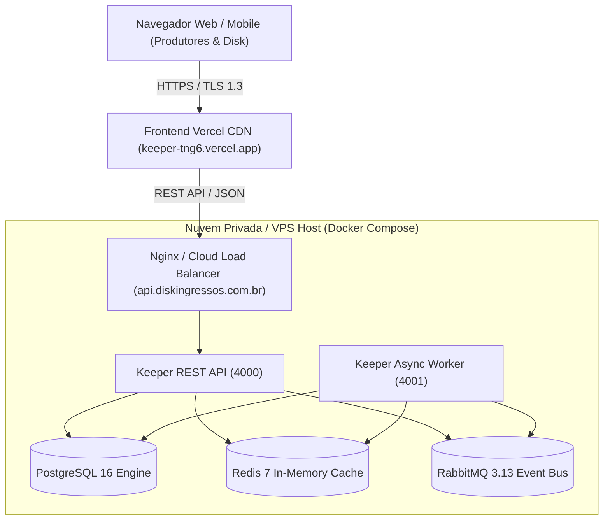

# Guia Oficial de Deploy em Produção — Keeper ERP

Este documento orienta a equipe de engenharia e operações no deploy, configuração e manutenção da infraestrutura de produção do **Keeper ERP** (DiskIngressos).

---

## 🌐 Links Oficiais de Acesso

- **Aplicação Frontend Oficial (Vercel):** [https://keeper-tng6.vercel.app/](https://keeper-tng6.vercel.app/)
- **API REST Oficial (NestJS):** `https://keeper-tng6.vercel.app/api/v1` (ou endpoint VPS dedicado)
- **Documentação Interativa (Swagger OpenAPI):** [https://keeper-tng6.vercel.app/api/docs](https://keeper-tng6.vercel.app/api/docs)
- **Healthcheck Probe:** `/api/v1/health`

---

## 🏗️ Topologia da Arquitetura de Produção



---

## 📦 Serviços Docker Orquestrados

| Serviço | Imagem Base | Porta Interna | Porta Exposta | Função |
| :--- | :--- | :--- | :--- | :--- |
| **`postgres`** | `postgres:16-alpine` | `5432` | `5432` | Banco relacional oficial, Ledger imutável e transações |
| **`redis`** | `redis:7-alpine` | `6379` | `6379` | Cache de alta velocidade, sessões e rate limiting |
| **`rabbitmq`** | `rabbitmq:3.13-management-alpine` | `5672`, `15672` | `5672`, `15672` | Barramento de eventos assíncronos e fila de webhooks |
| **`api`** | `Dockerfile.api` (Node 20 Alpine) | `4000` | `4000` | API Central NestJS com Swagger, RBAC e regras de negócio |
| **`worker`** | `Dockerfile.worker` (Node 20 Alpine) | `4001` | `4001` | Processador em segundo plano, cron jobs e conciliação |

---

## 🚀 Passo a Passo de Instalação no Servidor (VPS / Cloud)

### 1. Pré-requisitos
No servidor Ubuntu 22.04 LTS ou 24.04 LTS:
```bash
sudo apt update && sudo apt upgrade -y
sudo apt install -y git curl wget ufw ca-certificates gnupg lsb-release

# Instalar Docker Engine oficial e Docker Compose
curl -fsSL https://get.docker.com -o get-docker.sh
sudo sh get-docker.sh
sudo usermod -aG docker $USER
```

### 2. Clonar o Repositório
```bash
git clone https://github.com/viniciusadami2018/keeper.git
cd keeper
```

### 3. Configurar Variáveis de Ambiente
Copie o template de produção e configure as senhas seguras:
```bash
cp .env.production.example .env.production
nano .env.production
```

Principais parâmetros:
- `JWT_SECRET`: crie um segredo com `openssl rand -base64 48`
- `POSTGRES_PASSWORD`: senha forte para o banco de dados
- `REDIS_PASSWORD`: senha do cluster Redis
- `CORS_ORIGIN`: defina `https://keeper-tng6.vercel.app` para aceitar requisições do frontend oficial

### 4. Executar Deploy Automatizado
Execute o script oficial de inicialização:
```bash
chmod +x scripts/deploy-prod.sh
./scripts/deploy-prod.sh
```

---

## 🔒 Configuração de Proxy Reverso Nginx & SSL (Certbot)

Crie o arquivo `/etc/nginx/sites-available/keeper-api.conf`:
```nginx
server {
    server_name api.diskingressos.com.br;

    location / {
        proxy_pass http://127.0.0.1:4000;
        proxy_http_version 1.1;
        proxy_set_header Upgrade $http_upgrade;
        proxy_set_header Connection 'upgrade';
        proxy_set_header Host $host;
        proxy_cache_bypass $http_upgrade;
        proxy_set_header X-Real-IP $remote_addr;
        proxy_set_header X-Forwarded-For $proxy_add_x_forwarded_for;
        proxy_set_header X-Forwarded-Proto $scheme;
    }
}
```

Habilite o site e gere o certificado SSL gratuito:
```bash
sudo ln -s /etc/nginx/sites-available/keeper-api.conf /etc/nginx/sites-enabled/
sudo nginx -t
sudo systemctl reload nginx
sudo certbot --nginx -d api.diskingressos.com.br
```

---

## 🔄 Rotina de Backup do Banco de Dados
Adicione a rotina de dump no crontab (`crontab -e`):
```cron
# Backup diário às 03:00 da manhã compactado em gzip
0 3 * * * docker exec keeper-postgres-prod pg_dump -U erp_admin erp_db | gzip > /backups/keeper_db_$(date +\%Y\%m\%d_\%H\%M\%S).sql.gz
```

---

## 🩺 Monitoramento & Diagnóstico

- **Verificar logs da API em tempo real:**
  ```bash
  docker compose -f docker/docker-compose.prod.yml logs -f api
  ```
- **Verificar logs do Worker assíncrono:**
  ```bash
  docker compose -f docker/docker-compose.prod.yml logs -f worker
  ```
- **Checar saúde dos containers:**
  ```bash
  docker compose -f docker/docker-compose.prod.yml ps
  ```
- **Testar endpoint de saúde (Healthcheck):**
  ```bash
  curl -i http://localhost:4000/api/v1/health
  ```
